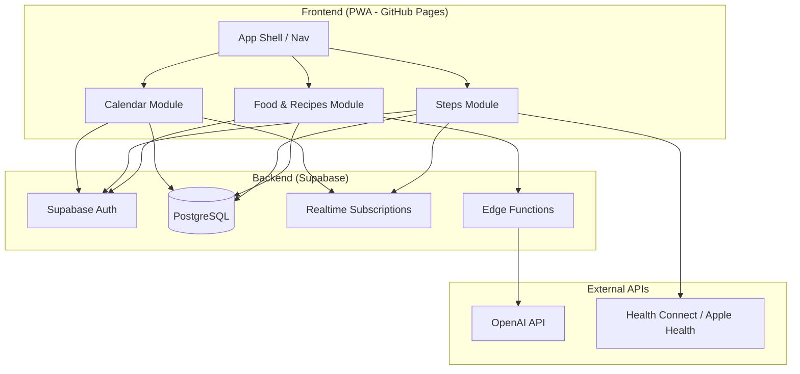
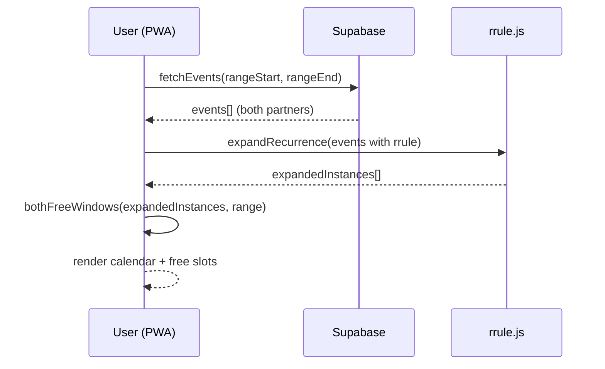
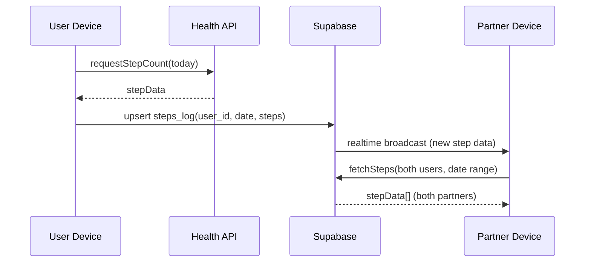
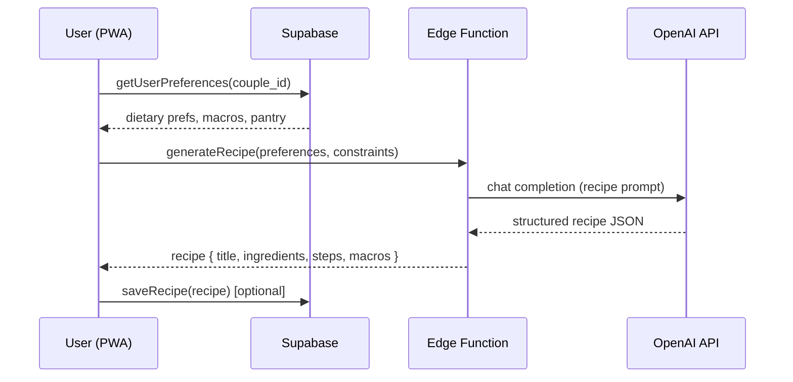

# Design Document: Couples Life App

## Overview

The Couples Life App is a unified PWA that brings together three core features for a couple (Jamall + Rebecca): a shared calendar with availability overlap detection, a step count fitness tracker with partner visibility, and a food tracker with AI-powered recipe generation. The app extends the existing Supabase-backed PWA architecture — two authenticated users sharing a real-time data layer with full mutual visibility.

The design philosophy is "see each other's life without friction." Each module surfaces partner data by default: the calendar shows when you're both free, the step tracker shows both partners' daily counts, and the food tracker lets you plan meals together with AI suggestions based on shared dietary preferences and macro targets.

Backend remains Supabase (Postgres + Auth + Realtime). Frontend is a single-page PWA hosted on GitHub Pages. All three features share the same auth session and navigation shell.

## Architecture




## Sequence Diagrams

### Calendar: Finding Free Windows



### Steps: Daily Sync & Partner View



### Food: AI Recipe Generation




## Components and Interfaces

### Component 1: App Shell

**Purpose**: Navigation, auth gating, shared layout, and view routing across the three modules.

**Interface**:
```javascript
// App Shell API
const AppShell = {
  init(supabaseUrl, anonKey),        // bootstrap app, check session
  navigate(viewId),                   // switch between calendar/steps/food
  getCurrentUser(),                   // returns Profile of logged-in user
  getPartner(),                       // returns Profile of the other user
  onAuthStateChange(callback),        // react to login/logout
}
```

**Responsibilities**:
- Gate all views behind Supabase auth
- Maintain bottom nav with active state
- Provide partner context to all child modules
- Handle PWA install prompt and offline state

### Component 2: Calendar Module

**Purpose**: Shared event management with recurrence expansion and availability overlap detection.

**Interface**:
```javascript
// Calendar Module API
const CalendarModule = {
  fetchEvents(rangeStart, rangeEnd),           // returns Event[] for both users
  createEvent(eventData),                       // insert new event
  updateEvent(eventId, changes),                // edit event (own or shared)
  deleteEvent(eventId),                         // remove event (own or shared)
  expandRecurrence(events, rangeStart, rangeEnd), // expand RRULEs
  bothFreeWindows(events, rangeStart, rangeEnd, options), // core overlap calc
  subscribeToChanges(callback),                 // realtime updates
}
```

**Responsibilities**:
- CRUD operations on events table
- Expand RRULE patterns into concrete instances
- Calculate mutual free windows
- Render week/month views with colour-coded ownership
- Real-time sync when partner adds/edits events


### Component 3: Steps Module

**Purpose**: Daily step count tracking with partner visibility, goals, streaks, and friendly competition.

**Interface**:
```javascript
// Steps Module API
const StepsModule = {
  logSteps(date, stepCount),                    // manual entry or sync
  fetchSteps(userId, dateRange),                // get step history
  fetchBothPartners(dateRange),                 // combined view
  getStreak(userId),                            // consecutive days meeting goal
  getDailyGoal(userId),                         // current step goal
  setDailyGoal(goal),                           // update own goal
  syncFromHealthAPI(),                          // pull from device health data
  subscribeToUpdates(callback),                 // realtime partner updates
}
```

**Responsibilities**:
- Store and retrieve daily step counts for both users
- Calculate streaks (consecutive days hitting goal)
- Provide comparative stats (who walked more today/this week)
- Optional health API integration for auto-sync
- Real-time display of partner's step progress

### Component 4: Food & Recipe Module

**Purpose**: Meal logging, macro tracking, and AI-powered recipe generation tailored to the couple's dietary needs.

**Interface**:
```javascript
// Food & Recipe Module API
const FoodModule = {
  logMeal(mealData),                            // add food entry
  fetchMeals(userId, date),                     // get day's meals
  getDailyMacros(userId, date),                 // aggregate P/C/F/kcal
  generateRecipe(constraints),                  // AI recipe via edge function
  saveRecipe(recipe),                           // store to shared recipe book
  fetchRecipeBook(filters),                     // browse saved recipes
  getPreferences(),                             // couple's dietary prefs
  updatePreferences(prefs),                     // edit shared preferences
  getPantryItems(),                             // what's in the kitchen
  updatePantry(items),                          // update pantry list
}
```

**Responsibilities**:
- Meal logging with nutritional data (kcal, protein, carbs, fats)
- Daily/weekly macro summaries per user
- Shared recipe book that both partners can browse
- AI recipe generation using OpenAI with couple's constraints
- Pantry management for "what can we make tonight?" queries


## Data Models

### Existing Tables (from calendar spec)

```sql
-- profiles (already defined)
-- events (already defined with RRULE support)
```

### New Table: steps_log

```sql
create table public.steps_log (
  id         uuid primary key default gen_random_uuid(),
  user_id    uuid not null references public.profiles(id) on delete cascade,
  log_date   date not null,
  step_count integer not null check (step_count >= 0),
  source     text not null default 'manual', -- 'manual', 'health_connect', 'apple_health'
  goal       integer not null default 10000,
  created_at timestamptz not null default now(),
  updated_at timestamptz not null default now(),
  unique(user_id, log_date)  -- one entry per user per day
);
alter table public.steps_log enable row level security;
create index steps_user_date_idx on public.steps_log(user_id, log_date);
```

**Validation Rules**:
- step_count must be >= 0 and <= 200000 (sanity cap)
- log_date cannot be in the future
- goal must be > 0

### New Table: meals

```sql
create table public.meals (
  id         uuid primary key default gen_random_uuid(),
  user_id    uuid not null references public.profiles(id) on delete cascade,
  meal_date  date not null,
  meal_type  text not null check (meal_type in ('breakfast','lunch','dinner','snack')),
  title      text not null,
  calories   integer not null default 0,
  protein_g  numeric(6,1) not null default 0,
  carbs_g    numeric(6,1) not null default 0,
  fats_g     numeric(6,1) not null default 0,
  notes      text,
  created_at timestamptz not null default now()
);
alter table public.meals enable row level security;
create index meals_user_date_idx on public.meals(user_id, meal_date);
```

**Validation Rules**:
- calories, protein_g, carbs_g, fats_g must be >= 0
- meal_type must be one of the enum values
- title cannot be empty


### New Table: recipes

```sql
create table public.recipes (
  id           uuid primary key default gen_random_uuid(),
  created_by   uuid not null references public.profiles(id) on delete cascade,
  title        text not null,
  description  text,
  ingredients  jsonb not null default '[]',    -- [{name, amount, unit}]
  steps        jsonb not null default '[]',    -- [{order, instruction}]
  prep_time_min integer,
  cook_time_min integer,
  servings     integer not null default 2,
  calories     integer,
  protein_g    numeric(6,1),
  carbs_g      numeric(6,1),
  fats_g       numeric(6,1),
  tags         text[] default '{}',            -- 'quick', 'high-protein', 'vegetarian'
  ai_generated boolean not null default false,
  is_favorite  boolean not null default false,
  created_at   timestamptz not null default now()
);
alter table public.recipes enable row level security;
create index recipes_tags_idx on public.recipes using gin(tags);
```

### New Table: dietary_preferences

```sql
create table public.dietary_preferences (
  id              uuid primary key default gen_random_uuid(),
  user_id         uuid not null references public.profiles(id) on delete cascade,
  allergies       text[] default '{}',
  dislikes        text[] default '{}',
  diet_type       text default 'flexible', -- 'flexible','vegetarian','vegan','keto','halal'
  calorie_target  integer,
  protein_target  integer,
  carbs_target    integer,
  fats_target     integer,
  updated_at      timestamptz not null default now(),
  unique(user_id)
);
alter table public.dietary_preferences enable row level security;
```

### New Table: pantry_items

```sql
create table public.pantry_items (
  id         uuid primary key default gen_random_uuid(),
  name       text not null,
  category   text default 'other', -- 'protein','vegetable','grain','dairy','spice','other'
  quantity   text,                  -- freeform: '500g', '2 cans', 'half bag'
  expires_at date,
  added_by   uuid not null references public.profiles(id),
  created_at timestamptz not null default now()
);
alter table public.pantry_items enable row level security;
```


### Row Level Security (all new tables)

```sql
-- STEPS: both partners see all, edit own
create policy "couple reads steps" on public.steps_log
  for select to authenticated using (true);
create policy "insert own steps" on public.steps_log
  for insert to authenticated with check (user_id = auth.uid());
create policy "update own steps" on public.steps_log
  for update to authenticated using (user_id = auth.uid());
create policy "delete own steps" on public.steps_log
  for delete to authenticated using (user_id = auth.uid());

-- MEALS: both see all, edit own
create policy "couple reads meals" on public.meals
  for select to authenticated using (true);
create policy "insert own meals" on public.meals
  for insert to authenticated with check (user_id = auth.uid());
create policy "update own meals" on public.meals
  for update to authenticated using (user_id = auth.uid());
create policy "delete own meals" on public.meals
  for delete to authenticated using (user_id = auth.uid());

-- RECIPES: shared — both read/write all
create policy "couple reads recipes" on public.recipes
  for select to authenticated using (true);
create policy "insert recipes" on public.recipes
  for insert to authenticated with check (created_by = auth.uid());
create policy "update recipes" on public.recipes
  for update to authenticated using (true);
create policy "delete recipes" on public.recipes
  for delete to authenticated using (true);

-- DIETARY PREFERENCES: both see all, edit own
create policy "couple reads prefs" on public.dietary_preferences
  for select to authenticated using (true);
create policy "upsert own prefs" on public.dietary_preferences
  for insert to authenticated with check (user_id = auth.uid());
create policy "update own prefs" on public.dietary_preferences
  for update to authenticated using (user_id = auth.uid());

-- PANTRY: fully shared
create policy "couple reads pantry" on public.pantry_items
  for select to authenticated using (true);
create policy "insert pantry" on public.pantry_items
  for insert to authenticated with check (added_by = auth.uid());
create policy "update pantry" on public.pantry_items
  for update to authenticated using (true);
create policy "delete pantry" on public.pantry_items
  for delete to authenticated using (true);
```


## Key Functions with Formal Specifications

### Function 1: bothFreeWindows()

```javascript
function bothFreeWindows(events, rangeStart, rangeEnd, options = {})
// Returns: Array<{ start: Date, end: Date }>
```

**Preconditions:**
- `events` is an array of expanded event instances (recurrence already resolved)
- Each event has `start: Date`, `end: Date`, `isBusy: boolean`
- `rangeStart` < `rangeEnd`, both valid Date objects
- `options.dayStartHour` is in [0, 23], defaults to 8
- `options.dayEndHour` is in [1, 24], `dayEndHour` > `dayStartHour`
- `options.minMinutes` > 0, defaults to 30

**Postconditions:**
- Returns array of non-overlapping time windows where neither user is busy
- Each window duration >= `minMinutes`
- All windows fall within waking hours (`dayStartHour` to `dayEndHour`)
- All windows fall within `[rangeStart, rangeEnd]`
- Windows are sorted chronologically
- No window overlaps with any `isBusy` event from either user

**Loop Invariants:**
- After processing day `d`: all free windows for days [rangeStart..d] have been computed
- The `cursor` variable always points to the start of the next potential free slot
- `merged` array is sorted and contains no overlapping intervals

### Function 2: calculateStreak()

```javascript
function calculateStreak(stepsLog, goal)
// Returns: { currentStreak: number, longestStreak: number, lastActiveDate: Date }
```

**Preconditions:**
- `stepsLog` is an array of `{ log_date: Date, step_count: number }`
- `stepsLog` is sorted by `log_date` descending (most recent first)
- `goal` is a positive integer

**Postconditions:**
- `currentStreak` = number of consecutive days (ending today or yesterday) where `step_count >= goal`
- `longestStreak` = maximum consecutive days meeting goal across entire history
- `lastActiveDate` = most recent date where goal was met, or null if never
- If today's steps haven't been logged, streak counts back from yesterday

**Loop Invariants:**
- At iteration `i`: streak counter reflects consecutive goal-met days from the starting point up to `stepsLog[i]`
- No gaps > 1 day exist in the counted streak

### Function 3: generateRecipePrompt()

```javascript
function generateRecipePrompt(preferences, pantryItems, constraints)
// Returns: string (OpenAI prompt)
```

**Preconditions:**
- `preferences` contains both users' dietary prefs (allergies, dislikes, diet_type, macros)
- `pantryItems` is an array of available ingredients (may be empty)
- `constraints` is an object with optional fields: { maxPrepTime, maxCalories, mealType, servings }
- Neither user's allergies appear in the requested ingredients

**Postconditions:**
- Returned prompt string incorporates ALL allergies from both users as exclusions
- Returned prompt respects the more restrictive diet_type between partners
- If pantryItems is non-empty, prompt requests recipes using those ingredients
- Prompt requests structured JSON output with: title, ingredients, steps, macros
- Prompt length does not exceed 4000 tokens

**Loop Invariants:** N/A (string construction, no loops)


### Function 4: aggregateDailyMacros()

```javascript
function aggregateDailyMacros(meals)
// Returns: { calories: number, protein: number, carbs: number, fats: number, mealCount: number }
```

**Preconditions:**
- `meals` is an array of meal objects for a single user on a single date
- Each meal has numeric `calories`, `protein_g`, `carbs_g`, `fats_g` fields (all >= 0)

**Postconditions:**
- `calories` = sum of all meal calories
- `protein` = sum of all meal protein_g
- `carbs` = sum of all meal carbs_g
- `fats` = sum of all meal fats_g
- `mealCount` = meals.length
- All returned values are >= 0
- If meals is empty, all values are 0

**Loop Invariants:**
- Running totals are always >= 0
- `mealCount` equals number of meals processed so far

### Function 5: syncStepsFromHealth()

```javascript
async function syncStepsFromHealth(userId, date)
// Returns: { synced: boolean, stepCount: number, source: string }
```

**Preconditions:**
- `userId` is a valid authenticated user UUID
- `date` is a valid Date, not in the future
- Health API permission has been granted by the user
- Device supports Web Health API or native bridge

**Postconditions:**
- If health data available: upserts steps_log row, returns `{ synced: true, stepCount, source }`
- If health data unavailable: returns `{ synced: false, stepCount: 0, source: 'none' }`
- Never overwrites a manually-entered count that's higher than the synced value
- `source` reflects actual data origin ('health_connect', 'apple_health', 'manual', 'none')

**Loop Invariants:** N/A (single async operation)

## Algorithmic Pseudocode

### Algorithm 1: Both-Free Window Calculation

```javascript
function bothFreeWindows(events, rangeStart, rangeEnd, {
  dayStartHour = 8,
  dayEndHour = 23,
  minMinutes = 30
} = {}) {
  // ASSERT: rangeStart < rangeEnd
  // ASSERT: dayStartHour < dayEndHour
  
  // Step 1: Extract and sort busy intervals
  const busy = events
    .filter(e => e.isBusy)
    .map(e => [e.start.getTime(), e.end.getTime()])
    .sort((a, b) => a[0] - b[0]);

  // Step 2: Merge overlapping busy intervals into union
  // INVARIANT: merged[] is sorted, non-overlapping after each iteration
  const merged = [];
  for (const [s, e] of busy) {
    const last = merged[merged.length - 1];
    if (last && s <= last[1]) {
      last[1] = Math.max(last[1], e);
    } else {
      merged.push([s, e]);
    }
  }

  // Step 3: For each day in range, subtract busy from waking hours
  // INVARIANT: after processing day d, free[] contains all valid free windows for [rangeStart..d]
  const free = [];
  const currentDay = new Date(rangeStart);
  
  while (currentDay < rangeEnd) {
    const dayStart = new Date(currentDay);
    dayStart.setHours(dayStartHour, 0, 0, 0);
    const dayEnd = new Date(currentDay);
    dayEnd.setHours(dayEndHour, 0, 0, 0);

    let cursor = dayStart.getTime();

    for (const [s, e] of merged) {
      if (e <= cursor || s >= dayEnd.getTime()) continue;
      if (s > cursor) {
        free.push([cursor, Math.min(s, dayEnd.getTime())]);
      }
      cursor = Math.max(cursor, e);
      if (cursor >= dayEnd.getTime()) break;
    }

    if (cursor < dayEnd.getTime()) {
      free.push([cursor, dayEnd.getTime()]);
    }

    currentDay.setDate(currentDay.getDate() + 1);
  }

  // Step 4: Filter by minimum duration
  // POSTCONDITION: all returned windows >= minMinutes and within waking hours
  return free
    .filter(([s, e]) => (e - s) >= minMinutes * 60000)
    .map(([s, e]) => ({ start: new Date(s), end: new Date(e) }));
}
```


### Algorithm 2: Step Streak Calculation

```javascript
function calculateStreak(stepsLog, goal) {
  // ASSERT: stepsLog sorted by log_date descending
  // ASSERT: goal > 0

  if (stepsLog.length === 0) {
    return { currentStreak: 0, longestStreak: 0, lastActiveDate: null };
  }

  const today = new Date();
  today.setHours(0, 0, 0, 0);

  let currentStreak = 0;
  let longestStreak = 0;
  let tempStreak = 0;
  let lastActiveDate = null;
  let expectDate = today;

  // Allow streak to start from yesterday if today not yet logged
  const firstLogDate = new Date(stepsLog[0].log_date);
  firstLogDate.setHours(0, 0, 0, 0);
  
  if (firstLogDate.getTime() === today.getTime() - 86400000) {
    expectDate = new Date(today.getTime() - 86400000);
  }

  // INVARIANT: at iteration i, tempStreak = consecutive days meeting goal
  //            counting backwards from expectDate
  let streakBroken = false;
  
  for (let i = 0; i < stepsLog.length; i++) {
    const entry = stepsLog[i];
    const entryDate = new Date(entry.log_date);
    entryDate.setHours(0, 0, 0, 0);

    if (entry.step_count >= goal) {
      if (!lastActiveDate) lastActiveDate = entryDate;
      tempStreak++;

      if (!streakBroken) {
        const diffDays = Math.round(
          (expectDate.getTime() - entryDate.getTime()) / 86400000
        );
        if (diffDays === 0) {
          currentStreak = tempStreak;
          expectDate = new Date(entryDate.getTime() - 86400000);
        } else {
          streakBroken = true;
          tempStreak = 1; // restart for longest calc
        }
      }
    } else {
      tempStreak = 0;
      if (!streakBroken) streakBroken = true;
    }

    longestStreak = Math.max(longestStreak, tempStreak);
  }

  // POSTCONDITION: currentStreak = consecutive days from today/yesterday
  //               longestStreak >= currentStreak
  return { currentStreak, longestStreak, lastActiveDate };
}
```

### Algorithm 3: AI Recipe Generation Pipeline

```javascript
async function generateRecipe(preferences, pantryItems, constraints) {
  // ASSERT: preferences contains both users' dietary data
  // ASSERT: constraints has valid optional fields

  // Step 1: Merge couple's dietary restrictions (union of exclusions)
  const allAllergies = [
    ...new Set([
      ...preferences.user1.allergies,
      ...preferences.user2.allergies
    ])
  ];
  const allDislikes = [
    ...new Set([
      ...preferences.user1.dislikes,
      ...preferences.user2.dislikes
    ])
  ];

  // Step 2: Determine most restrictive diet type
  const dietHierarchy = ['vegan', 'vegetarian', 'halal', 'keto', 'flexible'];
  const restrictiveDiet = dietHierarchy.find(
    d => d === preferences.user1.diet_type || d === preferences.user2.diet_type
  ) || 'flexible';

  // Step 3: Build macro targets (average of both, or use constraints override)
  const macroTarget = constraints.maxCalories || Math.round(
    ((preferences.user1.calorie_target || 2500) +
     (preferences.user2.calorie_target || 2000)) / 2
  );

  // Step 4: Construct prompt
  const prompt = buildRecipePrompt({
    allergies: allAllergies,
    dislikes: allDislikes,
    dietType: restrictiveDiet,
    macroTarget,
    pantryItems: pantryItems.map(i => i.name),
    mealType: constraints.mealType || 'dinner',
    servings: constraints.servings || 2,
    maxPrepTime: constraints.maxPrepTime
  });

  // Step 5: Call edge function → OpenAI
  const { data, error } = await supabase.functions.invoke('generate-recipe', {
    body: { prompt }
  });

  if (error) throw new Error(`Recipe generation failed: ${error.message}`);

  // POSTCONDITION: returned recipe contains no allergens from either user
  // POSTCONDITION: recipe respects restrictive diet type
  return data.recipe;
}
```


## Example Usage

```javascript
// === Calendar: Find when both free this week ===
const events = await CalendarModule.fetchEvents(weekStart, weekEnd);
const expanded = CalendarModule.expandRecurrence(events, weekStart, weekEnd);
const freeSlots = CalendarModule.bothFreeWindows(expanded, weekStart, weekEnd, {
  dayStartHour: 9,
  dayEndHour: 22,
  minMinutes: 60
});
// freeSlots = [{ start: Wed 18:00, end: Wed 22:00 }, { start: Sat 10:00, end: Sat 22:00 }]

// === Steps: Log and compare ===
await StepsModule.logSteps(new Date(), 12450);
const bothSteps = await StepsModule.fetchBothPartners({
  start: weekStart,
  end: weekEnd
});
// bothSteps = { jamall: [{date, steps}...], rebecca: [{date, steps}...] }
const myStreak = calculateStreak(bothSteps.jamall, 10000);
// myStreak = { currentStreak: 5, longestStreak: 14, lastActiveDate: today }

// === Food: Log a meal ===
await FoodModule.logMeal({
  meal_type: 'lunch',
  title: 'Chicken & rice bowl',
  calories: 650,
  protein_g: 45,
  carbs_g: 70,
  fats_g: 15
});
const todayMacros = await FoodModule.getDailyMacros(currentUser.id, new Date());
// todayMacros = { calories: 1850, protein: 145, carbs: 190, fats: 52, mealCount: 3 }

// === Food: Generate AI recipe from pantry ===
const recipe = await FoodModule.generateRecipe({
  maxPrepTime: 30,
  mealType: 'dinner',
  servings: 2
});
// recipe = { title: 'One-Pan Lemon Herb Chicken', ingredients: [...], steps: [...], 
//            macros: { calories: 520, protein: 42, carbs: 35, fats: 18 } }

// === Realtime: Partner updates ===
StepsModule.subscribeToUpdates((payload) => {
  if (payload.user_id !== currentUser.id) {
    updatePartnerStepDisplay(payload.step_count);
  }
});
```

## Correctness Properties

*A property is a characteristic or behavior that should hold true across all valid executions of a system — essentially, a formal statement about what the system should do. Properties serve as the bridge between human-readable specifications and machine-verifiable correctness guarantees.*

### Property 1: Free windows never overlap with busy events

*For any* set of events from both partners and any valid date range, every time window returned by bothFreeWindows must not overlap with any event where isBusy is true.

**Validates: Requirements 3.1, 3.5**

### Property 2: Free windows meet minimum duration

*For any* set of events and any configured minimum duration, every time window returned by bothFreeWindows must have a duration greater than or equal to minMinutes × 60000 milliseconds.

**Validates: Requirement 3.2**

### Property 3: Free windows are within waking hours

*For any* set of events and any configured dayStartHour and dayEndHour, every time window returned by bothFreeWindows must start at or after dayStartHour and end at or before dayEndHour.

**Validates: Requirement 3.3**

### Property 4: Free windows are sorted and non-overlapping

*For any* result from bothFreeWindows, the returned windows must be sorted in chronological order and no two windows may overlap each other.

**Validates: Requirements 3.4, 3.6**

### Property 5: RRULE expansion instance count

*For any* valid RRULE with a known number of occurrences within a date range, expanding the recurrence must produce exactly that number of instances within the range.

**Validates: Requirement 2.5**

### Property 6: Step log uniqueness per user per date

*For any* sequence of step log upserts for the same user and date, at most one step_log record exists for that user+date combination after all operations complete.

**Validates: Requirement 4.2**

### Property 7: Health sync never decreases manual value

*For any* existing manually-entered step count and any health API sync value that is lower, the stored step count after sync must remain the original higher manual value.

**Validates: Requirement 4.6**

### Property 8: Streak calculation invariants

*For any* step log history and positive goal value: (a) currentStreak is less than or equal to longestStreak, and (b) if currentStreak is greater than zero, then today or yesterday has a step count meeting or exceeding the goal.

**Validates: Requirements 6.1, 6.2, 6.3, 6.4**

### Property 9: Macro aggregation equals independent sum

*For any* set of meals for a single user on a single date, the aggregated daily macros must equal the independent sum of each meal's calories, protein_g, carbs_g, and fats_g. If the meal set is empty, all values must be zero.

**Validates: Requirements 7.5, 7.6**

### Property 10: Allergy exclusion list is the union of both partners

*For any* two sets of partner allergies, the merged exclusion list used for recipe generation must contain every allergy from both partners (the set union).

**Validates: Requirements 8.2, 10.3**

### Property 11: Restrictive diet type selection

*For any* pair of diet types from the two partners, the diet type selected for recipe generation must be the more restrictive one according to the hierarchy: vegan > vegetarian > halal > keto > flexible.

**Validates: Requirement 8.3**

### Property 12: Generated recipes contain no allergens

*For any* generated recipe and any combined allergy list from both partners, no ingredient in the recipe may match any item in the allergy exclusion list.

**Validates: Requirement 8.6**

### Property 13: Generated recipes respect diet type

*For any* generated recipe, the recipe must comply with the more restrictive diet type selected for the couple.

**Validates: Requirement 8.7**

### Property 14: Pantry items included in generation prompt

*For any* non-empty set of pantry items, the recipe generation prompt must include all pantry item names so the AI can prefer available ingredients.

**Validates: Requirements 8.4, 9.6**

### Property 15: Recipe book filtering correctness

*For any* set of saved recipes and any filter criteria (tags, meal type, favorite status), every recipe in the filtered results must match the specified criteria, and no matching recipe is excluded.

**Validates: Requirement 9.2**

### Property 16: Partner comparison correctness

*For any* two step counts for the same period, the comparative display must correctly identify which partner has the higher total.

**Validates: Requirement 5.3**


## Error Handling

### Error Scenario 1: Health API Unavailable

**Condition**: Device doesn't support Health Connect / Apple Health, or permission denied
**Response**: Fall back to manual step entry; show unobtrusive prompt explaining auto-sync isn't available
**Recovery**: User enters steps manually; system marks source as 'manual'

### Error Scenario 2: AI Recipe Generation Fails

**Condition**: OpenAI API returns error, times out, or returns malformed JSON
**Response**: Show user-friendly error ("Couldn't generate recipe right now"), offer to retry
**Recovery**: Retry with exponential backoff (max 3 attempts). If all fail, suggest browsing saved recipe book instead.

### Error Scenario 3: Realtime Connection Drops

**Condition**: WebSocket to Supabase Realtime disconnects (network issue, device sleep)
**Response**: Show subtle "offline" indicator in nav bar
**Recovery**: Auto-reconnect with Supabase's built-in retry. On reconnect, refetch latest data to catch missed updates.

### Error Scenario 4: Concurrent Event Edit (Calendar)

**Condition**: Both partners edit the same shared event simultaneously
**Response**: Last-write-wins (Supabase default). `updated_at` timestamp tracks recency.
**Recovery**: If a conflict is detected via realtime, show a toast: "Rebecca just updated this event" with option to refresh.

### Error Scenario 5: Invalid Macro Data Entry

**Condition**: User enters negative calories or unreasonably high values (>10000 kcal single meal)
**Response**: Client-side validation prevents submission. Show inline error message.
**Recovery**: User corrects the value. DB constraint (`check >= 0`) serves as safety net.

## Testing Strategy

### Unit Testing Approach

Key test cases per module:
- **bothFreeWindows**: empty events, fully busy day, overlapping events from both users, events spanning midnight, minimum duration filtering
- **calculateStreak**: empty log, all days met, single day gap, streak starting yesterday (today not logged)
- **aggregateDailyMacros**: empty meals array, single meal, multiple meals, zero-value fields
- **generateRecipePrompt**: both users have allergies, one user is vegan, empty pantry, full constraints

Coverage goal: 90%+ for core algorithm functions.

### Property-Based Testing Approach

**Property Test Library**: fast-check (JavaScript)

Properties to test with generated inputs:
- Free windows never overlap with busy events (generate random event sets)
- Free window duration always meets minimum threshold
- Streak calculation: currentStreak is always <= longestStreak
- Macro aggregation always equals independent sum calculation
- Recipe prompt always excludes all allergens from both users

### Integration Testing Approach

- Supabase RLS: verify user A cannot update user B's personal records
- Supabase RLS: verify both users can read all records
- Realtime: verify event creation by user A triggers subscription on user B
- Edge function: verify recipe generation returns valid structured JSON
- Full flow: create event → fetch events → verify in bothFreeWindows output


## Performance Considerations

- **Recurrence expansion**: Expand only within the visible range (week/month view), never the entire RRULE history. Cache expanded results for the current view.
- **Step data queries**: Index on `(user_id, log_date)` ensures fast range queries. For charts showing 30/90 day trends, fetch once and cache client-side.
- **Realtime subscriptions**: Subscribe to specific tables/filters rather than entire database. Unsubscribe when switching views.
- **AI recipe generation**: Edge function with 30s timeout. Cache recent recipes to avoid duplicate API calls for same constraints.
- **Image-free design**: No food images or recipe photos — keeps the app fast and avoids storage costs. Text-based UI matches the existing coaching portal aesthetic.

## Security Considerations

- **Auth**: All API calls go through Supabase with JWT auth. No anonymous access.
- **RLS enforcement**: Every table has row-level security. Even if the frontend has a bug, the database won't leak data.
- **API keys**: OpenAI key stored only in Supabase Edge Function secrets — never exposed to the client.
- **Input sanitization**: All user inputs (meal titles, notes, pantry items) are parameterized through Supabase client — no raw SQL injection risk.
- **Two-person scope**: No invite system, no public profiles, no sharing beyond the couple. If this ever needs to scale, add `household_id` — but don't build it now.

## Dependencies

| Dependency | Purpose | Version Strategy |
|---|---|---|
| `@supabase/supabase-js` | Database, Auth, Realtime, Edge Functions | Pin to latest stable |
| `rrule` | iCal RRULE expansion for recurring events | Pin to ^2.x |
| `fast-check` | Property-based testing | Dev dependency, latest |
| OpenAI API | Recipe generation (via Edge Function) | API versioned server-side |
| Health Connect API | Step sync on Android (Web API when available) | Progressive enhancement |
| Apple Health (via PWA bridge) | Step sync on iOS | Progressive enhancement |

**No additional frontend frameworks.** The app stays as a vanilla JS PWA consistent with the existing coaching portal. CSS uses the same design system (dark theme, JetBrains Mono, Inter Tight, acid green accent).
